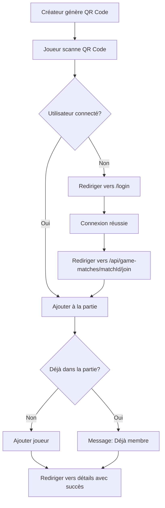

# Invitations aux Parties par QR Code

## Vue d'ensemble

Cette fonctionnalité permet aux créateurs de parties de générer un QR code d'invitation qui permet aux joueurs de rejoindre automatiquement une partie en scannant le code.

## Fonctionnement

### 1. Génération du QR Code

- Dans la page de détails d'une partie (`/game-matches/[matchId]`), le créateur de la partie voit un bouton "QR Code d'invitation" à côté du bouton "Ajouter un joueur".
- En cliquant sur ce bouton, un dialog s'ouvre affichant un QR code généré dynamiquement.
- Le QR code contient l'URL : `{ORIGIN}/api/game-matches/{matchId}/join`

### 2. Scan du QR Code

Lorsqu'un utilisateur scanne le QR code :

#### Utilisateur connecté
- L'utilisateur est automatiquement ajouté à la partie
- Il est redirigé vers la page de détails de la partie avec un message de succès
- Si l'utilisateur est déjà dans la partie, un message l'informe qu'il est déjà membre

#### Utilisateur non connecté
- L'utilisateur est redirigé vers `/login?callbackUrl=/api/game-matches/{matchId}/join`
- Après la connexion réussie, il est automatiquement redirigé vers l'URL d'invitation
- L'ajout à la partie se fait automatiquement, puis redirection vers la page de détails

### 3. Gestion des erreurs

Les erreurs possibles sont affichées dans la page de détails de la partie ou la liste des parties :
- Partie non trouvée
- Utilisateur non trouvé
- Erreur lors de l'ajout à la partie

## Implémentation technique

### Fichiers modifiés/créés

1. **`/app/api/game-matches/[matchId]/join/route.ts`**
   - Route API GET qui gère l'ajout d'un joueur via invitation
   - Vérifie l'authentification
   - Ajoute le joueur à la partie
   - Gère les redirections appropriées

2. **`/app/game-matches/[matchId]/GameMatchDetails.tsx`**
   - Ajout du bouton "QR Code d'invitation" (visible uniquement au créateur)
   - Dialog affichant le QR code généré
   - Gestion des messages de succès/erreur depuis les paramètres d'URL
   - Utilisation de la bibliothèque `qrcode` pour générer le QR code

3. **`/app/login/page.tsx`**
   - Support du paramètre `callbackUrl` pour redirection après connexion
   - Redirection vers l'URL de callback après vérification du code OTP

### Dépendances ajoutées

- `qrcode` : Génération des QR codes
- `@types/qrcode` : Types TypeScript pour qrcode

## Flux utilisateur

## Sécurité

- Seuls les utilisateurs authentifiés peuvent rejoindre une partie
- Les invitations ne nécessitent pas de token d'expiration (la partie elle-même sert de validation)
- Le créateur peut toujours retirer des joueurs après leur ajout

## Améliorations futures possibles

- Ajouter une date d'expiration aux invitations
- Permettre de générer des liens à usage unique
- Ajouter des statistiques sur les invitations utilisées
- Permettre de désactiver les invitations pour une partie
